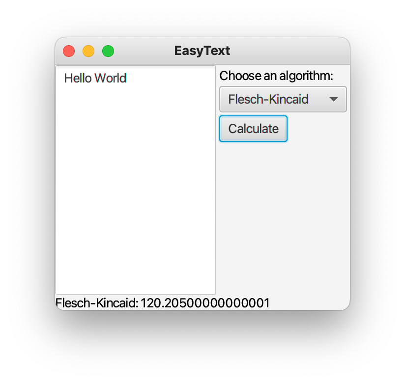

# EasyText

- 기존 모듈을 수정하거나 재컴파일하지 않고 새 분석 알고리즘을 추가할 수 있다.
- 다양한 프론트엔드에서 동일한 분석 알고리즘을 재사용할 수 있어야 한다.
- 재 컴파일 없이 그리고 각 구성에 대한 모든 코드를 배포하지 않고도 다양한 설정을 지원할 수 있어야 한다.

## 기능

1. 입력된 텍스트를 읽는다.
2. 많은 가독성 공식들은 문장 또는 단어 단위에 적용되기 때문에 텍스트를 문장과 단어로 나눈다.
3. 텍스트에 하나 이상의 분석 알고리즘을 적용한다.
4. 사용자에게 결과를 보여 준다.

## 실행

- [컴파일 & 패키징](compile.package.sh)
- [실행](run.sh)

### 모듈 한개

```bash
java -p mods -m easytext lorem.ipsum.txt

Reading lorem.ipsum.txt
Flesch-Kincaid: 48.16192413091662
```

### 모듈 두개

#### 탐색 에러

- `easytext.cli`에서 `requires easytext.analysis`가 빠졌을 때
- `easytext.analysis`에서 `exports foo.easytext.analysis`가 빠졌을 때

```bash
javac -d out/easytext.two --module-source-path src -m easytext.cli

src/easytext.cli/foo/easytext/cli/Main.java:11: error: package foo.easytext.analysis does not exist
import foo.easytext.analysis.FleschKincaid;
                            ^
src/easytext.cli/foo/easytext/cli/Main.java:27: error: cannot find symbol
        System.out.println("Flesch-Kincaid: " + new FleschKincaid().analyze(sentences));
                                                    ^
  symbol:   class FleschKincaid
  location: class Main
2 errors
```

#### 순환 의존성 에러

- `easytext.analysis`에서 `requires easytext.cli`도 있을 때

```bash
javac -d out/easytext.two --module-source-path src -m easytext.cli

src/easytext.analysis/module-info.java:2: error: cyclic dependence involving easytext.cli
    requires easytext.cli;
                     ^
error: cannot access module-info
  cannot resolve modules
2 errors
```

### 모듈 세개

#### 의존성 탐색

- JavaDoc: [javafx.application.Application](https://docs.oracle.com/javase/9/docs/api/javafx/application/Application.html)
- `java --list-modules | grep javafx`
- `java --describe-module javafx.controls`

`easytext.gui/module-info.java`

```java
module easytext.gui {
    requires javafx.graphics;
    requires javafx.controls;
    requires easytext.anaylsis;
}
```

#### 런타임 에러

- 컴파일 성공
- 런타임 에러: `IllegalAccessException: module easytext.gui does not export foo.easytext.gui to module javafx.graphics`
- `easytext.gui.Main.main:Application.launch(args)`
  - JavaFX 리플렉션 사용: Main 인스턴스화 후 `start` 호출

```bash
java --module-path out/easytext.three -m easytext.gui/foo.easytext.gui.Main lorem.ipsum.txt

Exception in Application constructor
Exception in thread "main" java.lang.reflect.InvocationTargetException
	at java.base/jdk.internal.reflect.NativeMethodAccessorImpl.invoke0(Native Method)
	at java.base/jdk.internal.reflect.NativeMethodAccessorImpl.invoke(NativeMethodAccessorImpl.java:62)
	at java.base/jdk.internal.reflect.DelegatingMethodAccessorImpl.invoke(DelegatingMethodAccessorImpl.java:43)
	at java.base/java.lang.reflect.Method.invoke(Method.java:564)
	at java.base/sun.launcher.LauncherHelper$FXHelper.main(LauncherHelper.java:945)
Caused by: java.lang.RuntimeException: Unable to construct Application instance: class foo.easytext.gui.Main
	at javafx.graphics/com.sun.javafx.application.LauncherImpl.launchApplication1(LauncherImpl.java:963)
	at javafx.graphics/com.sun.javafx.application.LauncherImpl.lambda$launchApplication$2(LauncherImpl.java:198)
	at java.base/java.lang.Thread.run(Thread.java:844)
Caused by: java.lang.IllegalAccessException: class com.sun.javafx.application.LauncherImpl (in module javafx.graphics) cannot access class foo.easytext.gui.Main (in module easytext.gui) because module easytext.gui does not export foo.easytext.gui to module javafx.graphics
```

#### 제한적 익스포트

```java
module easytext.gui {
    exports foo.easytext.gui to javafx.graphics;
    requires javafx.graphics;
    requires javafx.controls;
    requires easytext.analysis;
}
```

#### 순환 참조

- 컴파일: 순환참조 불가
- 런타임: 가독성 관계 가능

#### 실행


